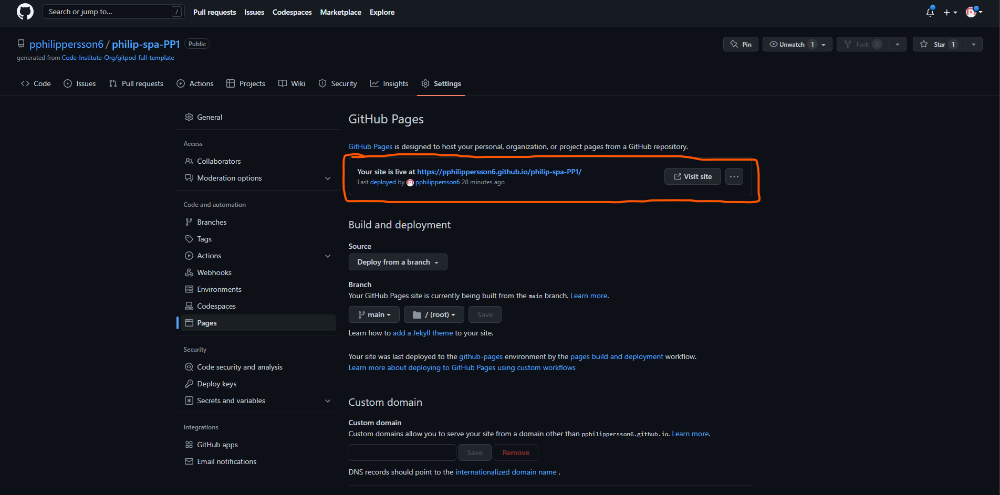
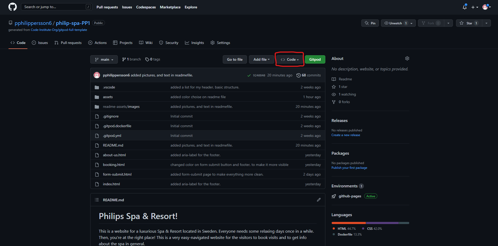
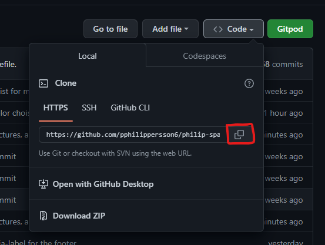

# Philips Spa & Resort!

This is a website for a luxurious Spa & Resort located in Sweden. Everyone needs some relaxing days once in a while. Then, you're at the right place!
This is a very easy-navigated website for the visitors to book visits and to get info about the spa in general.

# User Experience (UX)

## Wireframe
- The wireframe for this website is designed in [Miro](https://miro.com/). There is a design that is represented on most devices. This was a design that was made in the beginning, so there are some minor differences. 

## Structure of the site

Philip's Spa & Resort has three pages of content. The landingpage [Home](index.html) is the first page you will see. The other two pages are the [Booking](booking.html) and the [About Us](about-us.html). Here can you navigate to eighter get info about what content to expect, or you can fill in the contact form to get help by any questions.

## Color choice
I've chosen to use light colors on the background-color. This is to get a soft and relaxing feeling, to represent a feeling you want to achieve at a spa. It will blend in easily by the pictures i have chosen to use on my page.
I got the inspiration to find good color-matchings at the palettes by [mybrandnewlogo](https://mybrandnewlogo.com/)

- ### Landing Page

- The homepage (landing page) have a big picture of a pool, with a text in it, to get visitors attention. The things i wanted to create was luxorious and relaxing content.

### Navigation Bar

- I decided to have the nav-bar on all three landingpages, because it looks more clean, and also is easier to navigate trought the website. 
- The logo is also a link, that will take you home to the first page. This helps anyone if they got confused, and want to start over. 

### The weekend packages!

- The user will get two offers from whats discounted/announced right now.
- I have provided the two offers with a clickable picture, that will navigate them to a video of whats offered. 

 ### Footer section

- The footer have links to our social media, that will open up in a new tab in the browser. This is provided since they will klick at the links, and get more inspired to book a visit.
- The footer does also contain a contact us button, where the contact-email will open up in a new tab, or in the email application you're using.
- It also have a our service button to get navigated to what we offer. And this is a link to the about us section where the services are located. 

 ### Booking

- The booking site contains a map from google, with the location of the spa. This allows the user to locate, and find us without any doubts. 

    
- It also contains a text in a box, that reminds them to scroll down, to remove any distractions, and inform them that there is a contact form below. 
- Contact form is located at the bottom of the page. The contact form is for book, or if any questions appear, navigating on the side. 

### Thank you for contacting us page

- When submitting the contact-form, you will get directed to a extern page that says "thank you for contacting us, we will get back to you shortly"
Then, there's also a button that will get you back to the main page. 

 ### About Us
- The about us page contains infomation of what services we offer.
- The pictures and the text information makes the visitors feel more comfortable. This is because they can both see, and read what we offer. , , 

# Features

This is a website that is easy to navigate throught. 
It has some small features to make the website easier for the visitor to use. Like a contact-form, where you can ask all questions, a map where we are located and information about what we have to offer on the about us section.

## Existing Features

### Header
- The header is direct linked back to the main page/landing page, to easy help the user back to the first page.

### Navigation Menu
- Sited at the top of the whole website.
This navigation-menu is to help the users to navigate on the site. This is a fully functional bar, that will help you to move forward to the next page - or backwards to the homepage.

### Video links
- The weekend-packages have images that are linked to a video. This makes it easy to understand for the user what to expect, how the buffet, or massage is performed.

### Google Maps
- A google map, where you can see where the spa should be located (i have taken another location due to hide my personal address).

### Contactform
- A fully functional contactform that the users can send a free-text about a booking, questions or anything else they need, and when submitting - a new page appear, that says: thank you for your message, we will get back to you soon.

### Back to homepage
Back to homepage button in the submit-page, that will direct you back to the main page.

### About Us
- The about us section is where all the info for the spa is located. Like what the spa can offer, how the different stuff look like (images).

### Contact Us
A link in the footer where you can press - to get direct linked to the mail about the spa. If you press it, your desired email-program will open and the spa-mail will get input automatic.

## Features to implement in the future
- In the future, so do i want to add a shopping-bar, where the customers can buy stuff from our spa. Like a bathrobe, schampoo, lotion, bath salt & scrub and so on.

# Deployment

## Deploy the website-project
This site was deployed to Github pages. To deploy the site on Github pages, you do this:
1. At first, you navigate to **Settings** on the page where you see your project. 
2. Scroll down to you see the **Pages** section on the left side of the page. Press it. 
3. Under the **Build and deployment** header, navigate to the second header - **Branch**. Make sure to select the **source**, to your main. Its often called **main** or **master**, and then **save**. 
4. After some minutes, the website will be shown as live. if you refresh the page, and scroll at the top, your website-link will be shown. This indicate that everything is correct. This is how the link shall look like when you are ready to go (https://pphilippersson6.github.io/philip-spa-PP1/) 

### Fork the repository (Github)
You can create a copy of the project/repository by use something called forking. To fork the content on Github, 
1. Locate the project/repo you want to fork.
2. Press **Fork** on the top right side of the page. 
3. Press the green button to make the copy to your own github. 
This makes you a copy of the project in your own github. This is good if you are more than one to work on a project. It is hard to work on the same file more than one at a time.

### Local clone
To clone the project local, follow the steps below.
1. on the left side of the green button (Gitpod) where you press to get to the code,
there is a button called **code**, press it. 
2. Then press on the copy-button to get your own link. This is to clone the project, by getting an URL (**HTTPS**). 
3. Open **Git Bash**/**Terminal** and change it to the location you want to cone it.
4. Type **git clone** and paste the url, and enter.
Now you have a cloned project stored local.

# Testing

## Validator Testing
The codes have been tested by alot of aspects. One of the programs i used was the [W3C Validator](https://validator.w3.org/) This one checkt the HTML, and [Jigsaw W3C Validator](https://jigsaw.w3.org/css-validator/) checks the CSS.

- HTML check at the official [W3C validator](https://validator.w3.org/nu/?doc=https%3A%2F%2Fpphilippersson6.github.io%2Fphilip-spa-PP1%2F)
    - The first run showed me a small error - "Stray end tag". This was fixed evry simple, since i just had made two endtags. I removed the second endtag. 
    - I made a second run to check that nothing else was appearing. 
        No errors was found when i tested it. 

- CSS 
    - No errors was found here eighter, when i ran it trought the official [Jigsaw W3C validator](https://jigsaw.w3.org/css-validator/validator?uri=https%3A%2F%2Fpphilippersson6.github.io%2Fphilip-spa-PP1%2F&profile=css3svg&usermedium=all&warning=1&vextwarning=&lang=sv) 

    ## Lighthouse

## Responsive test (media)
- I have tested the site in developer-tools on google chrome. I made it responsive, so i could try all different sizes. My starting pixles was from 280px, and worked up to the biggest screen i could make, 2293 pixles. It's very responsive on those sizes.
- Down below, you can find some screenshots on the main - sizes i think is the most usable, to see its working all fine, and is very responsive.

 - Iphone SE (375x667px) SCREENSHOT!!!
 - Ipad Air (820x1180px) SCREENSHOT!!!
 - Ipad Mini (768x1024px) SCREENSHOT!!!

### Unfixed bugs
- No unfixed bugs.

    # Credits
    ### Content
    * The footer (structure) is borrowed from (https://alvarotrigo.com/blog/website-footers/). But i have changed some small stuff on it to make it my own.
    * My contact form is inspired, and i learned more about contact-form by [W3schools](https://www.w3schools.com/howto/howto_css_contact_form.asp)
    * The font is from [Google Fonts](https://fonts.google.com/)
    * The icons and fonts are also from [Bootstrap](https://getbootstrap.com/)
    * The colors are from color-palettes, by [My Brand New Logo](https://mybrandnewlogo.com/)
    * The map is made and borrowed from [Google Maps](https://goo.gl/maps/cWNoHBrx8QueiSH46)
    * The validation websites are from the official site [W3C Validator](https://validator.w3.org/) and [Jigsaw W3C Validator](https://jigsaw.w3.org/css-validator/)
    * The contact-form is inspired by [Majestic Form](https://www.majesticform.com/form-guides/html-email-form)
    * The wireframe is designed on [Miro.com](https://miro.com/)
    * Navigation-bar and the header are inspired by the love-running project made by [The Code Institute](https://learn.codeinstitute.net/courses/course-v1:CodeInstitute+LR101+2021_T1/courseware/4a07c57382724cfda5834497317f24d5/6fd29d155c3b42248ff57bae32978a4b/)

    ### Media
    * All of the images are borrowed from [Unsplash](https://unsplash.com/s/photos/spa)